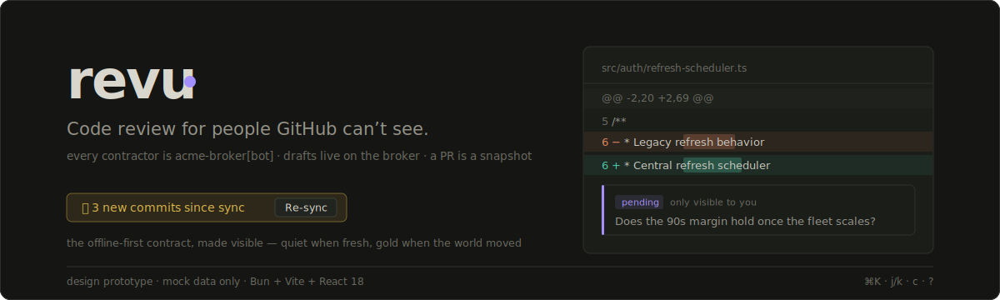
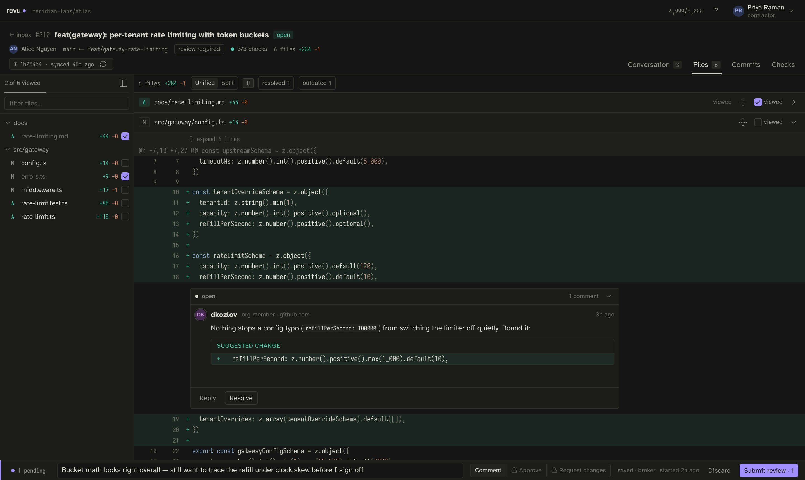
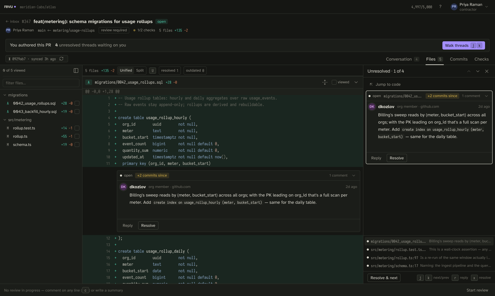
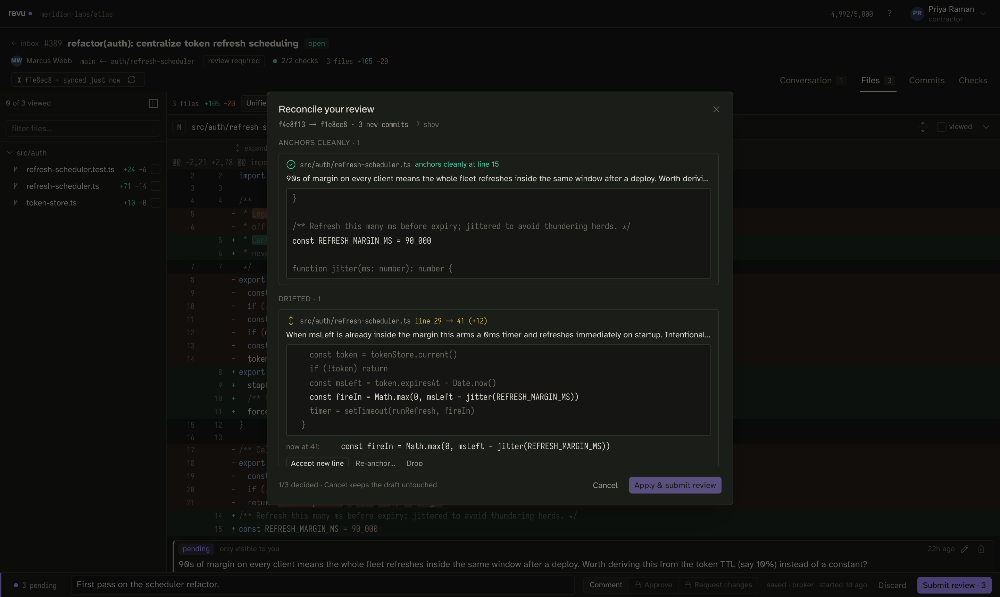
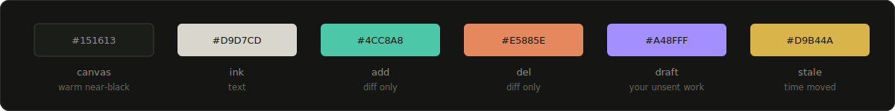

<div align="center">



<br/><br/>

**A design prototype of a self-hosted pull-request review client** for contractors
who work in disposable cloud workspaces against a client's private repos — where
every API call authenticates as one shared GitHub App, and github.com is closed to them.

<br/>


</div>

<br/>

> [!IMPORTANT]
> **This is a mockup, not a working app.** Nothing here talks to GitHub, a broker,
> or any network. Every screen, thread, diff, and failure mode is driven by
> hand-built fixtures behind a typed API boundary (`src/api/`) — the same boundary
> a real broker transport would implement. It exists to prove out the *design*:
> the interaction model, the caching semantics, and the error paths a tool like
> this would need. Treat everything below as a clickable specification.

<br/>

<table>
  <tr>
    <td width="50%">
      
      <p align="center"><sub><b>Inbox</b> — sections driven by what needs doing today; the unresolved count on your own PRs is the loudest number on screen</sub></p>
    </td>
    <td width="50%">
      
      <p align="center"><sub><b>Files</b> — virtualized, syntax-highlighted diffs with inline threads; the snapshot seal dates everything you're looking at</sub></p>
    </td>
  </tr>
  <tr>
    <td width="50%">
      
      <p align="center"><sub><b>Author mode</b> — walk unresolved feedback one thread at a time (<code>j</code>/<code>k</code>), with "+N commits since" hints for what might already be fixed</sub></p>
    </td>
    <td width="50%">
      
      <p align="center"><sub><b>Reconcile</b> — the branch moved mid-review; every pending comment gets an explicit decision. Nothing is ever silently discarded</sub></p>
    </td>
  </tr>
</table>

<br/>

## Why this exists

A contracting company gives its contractors access to a client's private repos
*without adding them to the client's GitHub org*. They work inside browser-based
dev workspaces on the client's hardware; a broker service holds a GitHub App key
and injects short-lived tokens. Cloning, branching, pushing, opening PRs — all fine.
But there is no github.com for these people: no web UI, no review tab, no
VS Code GitHub extension. **revu is what code review looks like when the review
platform can't know who you are.**

## The constraints are the product

Every awkward truth of that setup is encoded in the mock layer and surfaced in the UI,
rather than smoothed over:

| Constraint | What the design does about it |
|---|---|
| Every human is `meridian-review-bot[bot]` to GitHub | Author names are smuggled through comment-body prefixes and parsed back out — defensively. Org members' comments keep their real identity; both render native side by side |
| GitHub allows one pending review per identity | Drafts live broker-side, keyed to the human. They survive reloads, tomorrow, and a workspace rebuild — and the UI treats that persistence as quietly load-bearing |
| The App can't approve its own PRs | **Comment** is the primary action. Approve/Request-changes are gated per-PR; when unavailable, the UI says what to actually do instead of graying out a dead end |
| 5,000 req/hr shared across every workspace | A PR is a **snapshot**: one sync burst, then fully-local review — context expansion, thread reading, file jumping all work with the network gone. Only the PR list polls (free on ETag 304s) |
| The diff is a three-dot compare | Immutable content is keyed `merge_base...head`, never head alone; blobs are content-addressed. Threads/checks/mergeability refetch every sync, unconditionally — a thread resolved on github.com with zero commits still shows up |
| Comments anchor to a commit that can move | Submitting against a moved head routes through **reconcile**: every pending comment is classified clean / drifted / lost, and the human accepts, re-anchors, or drops each one explicitly |

## Design



Dark-only, dense, keyboard-first. The diff palette was solved first — teal/rust on
the blue↔orange axis survives red-green color deficiency, line tints stay under 10%
alpha so syntax highlighting reads on top, and saturation is spent only on word-level
changes. Violet is reserved for exactly one thing: **draft state, the work GitHub
cannot see** — which makes it the app's whole thesis rendered as a color. Gold means
time moved under you. The signature element is the *snapshot seal* on every PR header:
quiet when fresh, gold with a re-sync action when the world changed.

Faces: [Iosevka](https://typeof.net/Iosevka/) (narrow mono — most of the screen),
Atkinson Hyperlegible (UI text), Archivo (display). The full two-pass token plan,
the risk taken, and the reasoning live in [DESIGN.md](./DESIGN.md).

## Run the prototype

```sh
bun install
bun dev        # http://localhost:5173
```

`bun run scripts/smoke.ts` runs 45 headless checks over the mock data layer —
sync engine, cache keying, reconcile classification, identity smuggling,
per-human isolation. No browser needed.

### The demo map

The dev panel (avatar menu → *Dev panel…*) switches identity between contractors,
simulates latency and failure modes, shows the shared rate budget, and links every scenario:

| PR | Demonstrates |
|---|---|
| **#101** | First sync — the happy path, with honest request-cost copy |
| **#204** | 2,400-line diff: virtualization, lockfile + big-file collapse, a binary, a rename |
| **#312** | Mid-review: resolved / outdated threads, a suggestion block, reactions, a deep reply chain, a seeded draft |
| **#347** | You authored it — author banner + walk-the-queue mode |
| **#355** | Org-member PR — the one place Approve actually works |
| **#362** | Failing checks (full log excerpt) + merge conflict |
| **#389** | Stale snapshot + draft against an old head → the full reconcile flow (clean / drifted +12 / lost) |
| **#401** | Sync dies partway — a partial snapshot that names what's missing; retry fetches only that |
| **#410** | Base branch advanced, head didn't — the diff still changed, and the seal says so |
| **#415** | Thread resolved on github.com since sync, zero new commits — re-sync reuses every blob |

Keyboard: `?` for the sheet. `⌘K` palette · `g i`/`g f`/`g c` navigation · `j`/`k` files ·
`n`/`p` threads · `c` comment · `r` reply · `x` resolve · `v` viewed · `u` unified/split · `⇧R` re-sync.

## Architecture

Everything reads and writes through one interface — `RevuApi` in
[`src/api/client.ts`](./src/api/client.ts). [`src/api/mock/`](./src/api/mock)
implements it against fixtures in [`src/fixtures/`](./src/fixtures) that match real
GitHub REST/GraphQL response shapes exactly (`diff_hunk`, `original_line`, `side`,
`in_reply_to_id`, `PRRT_` node ids). Fixtures describe the **remote**; the mock store
owns the **cached** side — snapshots, content-addressed blobs, drafts, viewed state —
persisted and keyed per human, exactly as a broker would hold them. A real transport
is a sibling directory under `src/api/`; nothing else changes.

<br/>

<div align="center">
<sub>Built as a design exercise. The scenario, the company, the repo, and every person in the fixtures are fictional.</sub>
</div>
