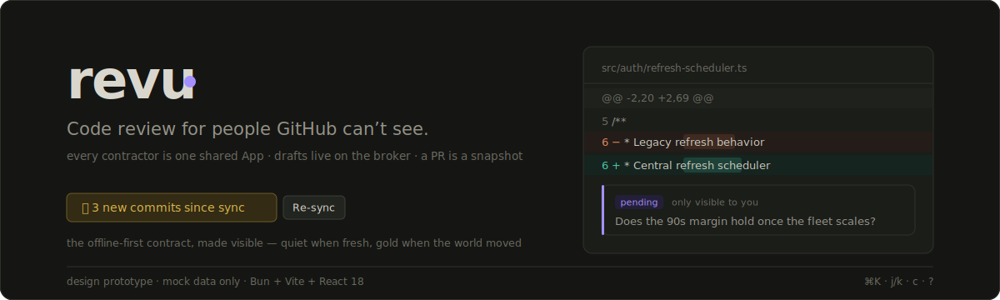
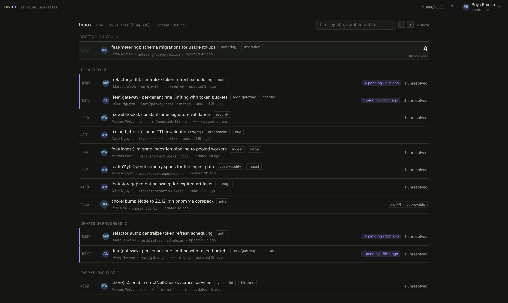
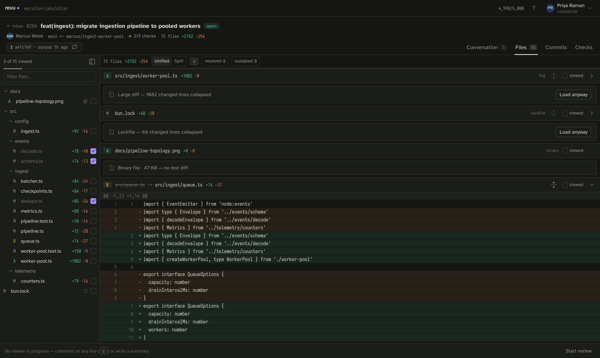
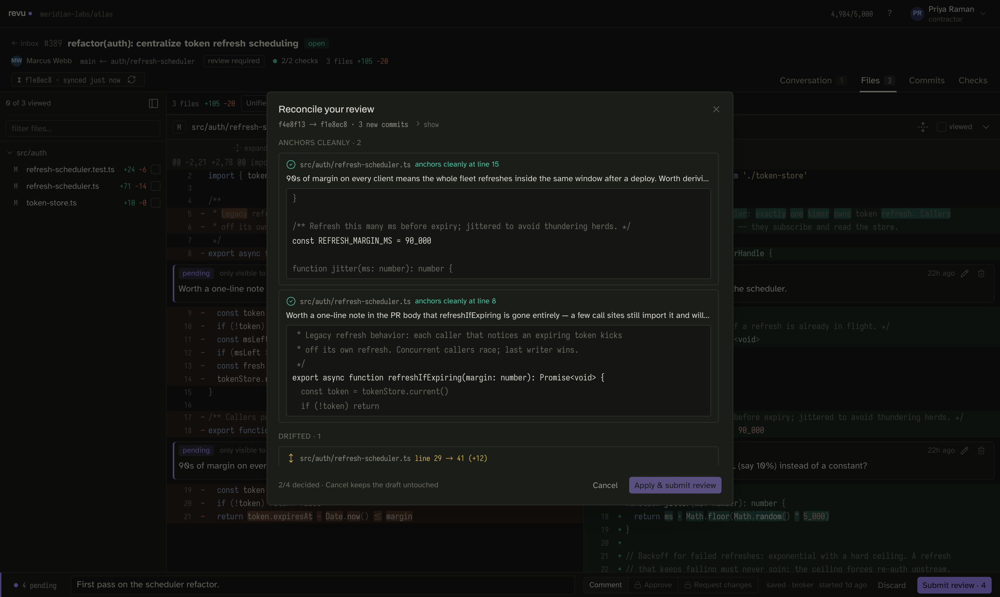
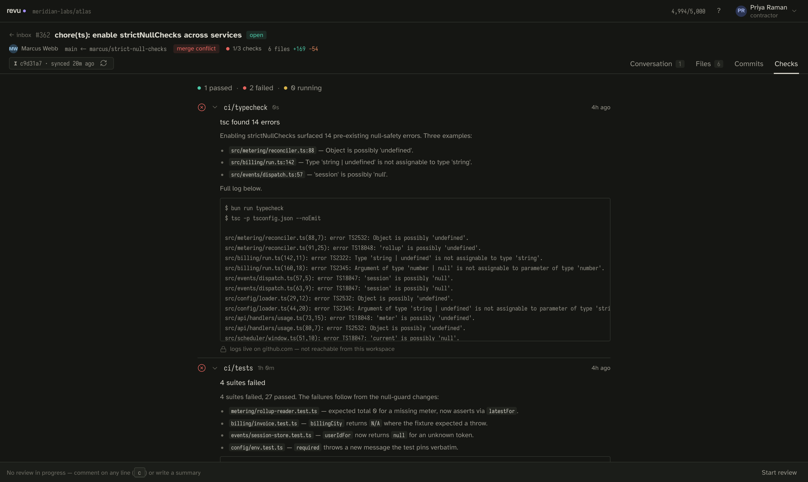
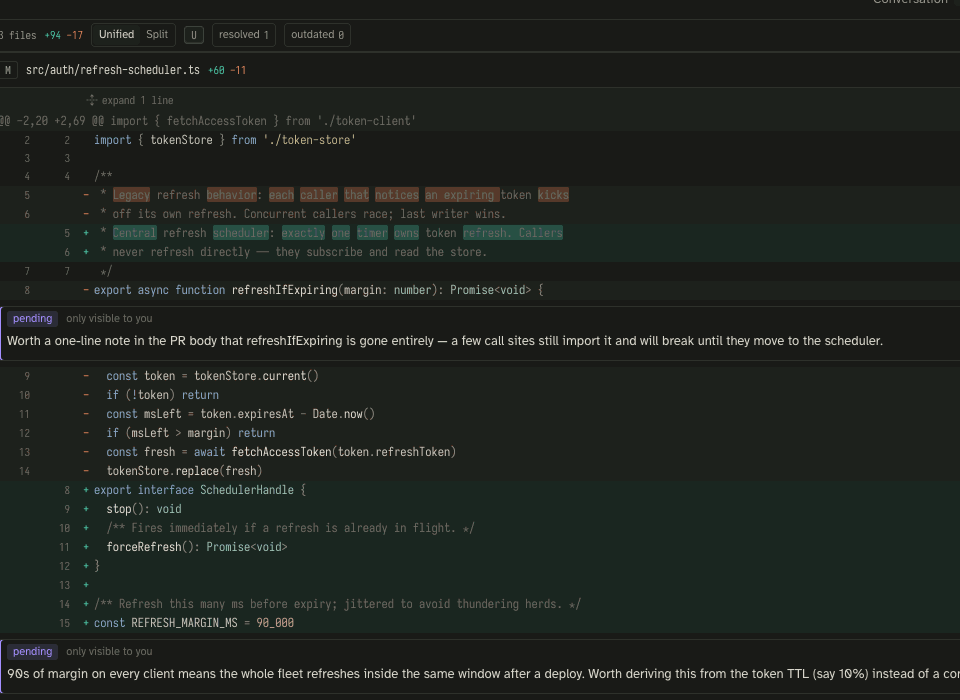
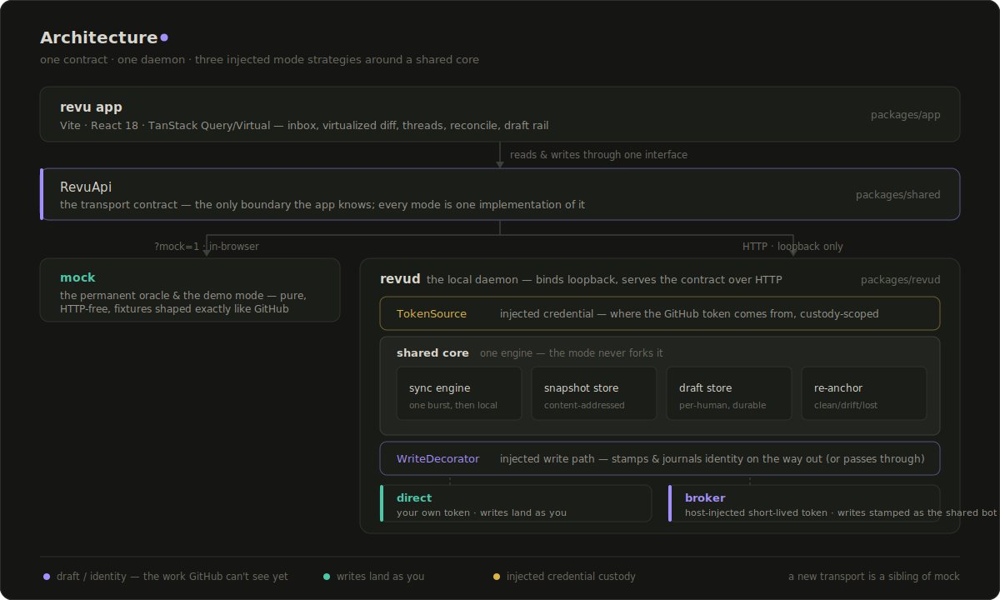
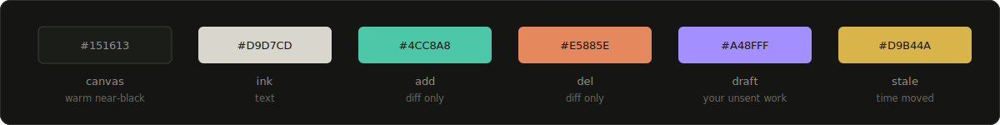

<div align="center">



<br/><br/>

**A self-hosted pull-request review client for people GitHub can't see** — a local-first
review tool that pulls a PR down as an offline snapshot, holds your draft in a durable
local store, and reconciles instead of failing when the branch moves under you.

<br/>

[](https://github.com/pat-mw/revu/actions/workflows/ci.yml)


</div>

<br/>

<table>
  <tr>
    <td width="50%">
      
      <p align="center"><sub><b>Inbox</b> — sections driven by what needs doing today; the unresolved count on your own PRs is the loudest number on screen</sub></p>
    </td>
    <td width="50%">
      
      <p align="center"><sub><b>Files</b> — virtualized, syntax-highlighted diffs; the snapshot seal dates everything you're looking at</sub></p>
    </td>
  </tr>
  <tr>
    <td width="50%">
      
      <p align="center"><sub><b>Threads</b> — read, reply, and resolve inline; drafts save as you type and survive a restart</sub></p>
    </td>
    <td width="50%">
      
      <p align="center"><sub><b>Reconcile</b> — the branch moved mid-review; every pending comment gets an explicit decision. Nothing is ever silently discarded</sub></p>
    </td>
  </tr>
  <tr>
    <td width="50%">
      
      <p align="center"><sub><b>Review bar</b> — submit a draft as Comment, Approve, or Request changes; Approve is gated to where it actually works</sub></p>
    </td>
    <td width="50%">
      
      <p align="center"><sub><b>Checks</b> — check runs and mergeability refetch on every sync, unconditionally</sub></p>
    </td>
  </tr>
</table>

<br/>

<div align="center">

<p><sub><b>Reconcile</b> — the branch moved mid-review; submit routes through an explicit decision for every pending comment instead of throwing the draft away</sub></p>
</div>

<br/>

## What it is

**revu** is a keyboard-first, offline-first pull-request review client you run yourself.
Point it at a repository you have cloned and it pulls the PR — diff, files, threads,
commits, checks — down in one sync burst, then lets you review with the network gone:
expand context, read threads, jump files, write inline comments. Your review is a
**local draft** that saves as you type and survives a restart. When you submit, if the
branch moved since you synced, revu routes you through **reconcile** rather than throwing
your work away.

It ships in a real, GitHub-talking **direct mode** — authenticated as you, via the `gh`
CLI — plus a permanent in-browser **mock mode** that is both the demo and the test oracle.
A shared-identity **broker mode**, for teams of contractors in disposable cloud
workspaces, is designed and reserved (see [Run modes](#run-modes)).

## Why it's different

Most review tools assume github.com is one browser tab away and that a "draft review"
is GitHub's single server-side pending review. revu assumes neither. It was built for the
hardest version of the problem — contractors reviewing a client's private repos from
disposable workspaces, where every API call authenticates as one shared GitHub App and
there is no github.com to fall back to — and the constraints that came out of that setting
turned out to make the *general* tool better. They are encoded in the product, not smoothed
over:

| Constraint | What revu does about it |
|---|---|
| A shared rate budget across every reviewer | A PR is a **snapshot**: one sync burst, then fully-local review — context expansion, thread reading, file jumping all work with the network gone. Only the PR list polls, free on ETag 304s |
| The draft has to outlive the session | Drafts live in a durable local store keyed to the human, saved as you type (debounced, flushed on tab hide). A restart — or, in a workspace, a rebuild — loses nothing, and the UI treats that persistence as quietly load-bearing |
| The comment anchors to a commit that can move | Submitting against a moved head routes through **reconcile**: every pending comment is classified clean / drifted / lost, and you accept, re-anchor, or drop each one explicitly. The draft survives everything until it lands |
| The diff is a three-dot compare | Immutable content is keyed `merge_base...head`, never head alone; blobs are content-addressed and reused across syncs. Threads, checks, and mergeability refetch every sync, unconditionally — a thread resolved elsewhere with zero new commits still shows up |
| Approve isn't always yours to give | **Comment** is the primary action. Approve / Request-changes are gated per-PR; when unavailable the UI says what to do instead of graying out a dead end |
| Some reviewers are one shared identity | In broker mode, author names are smuggled through comment-body prefixes and parsed back out defensively; org members keep their real identity. In direct mode this machinery is inert — GitHub authenticates you for real |

## How it works

<div align="center">

</div>

The React app reads and writes through exactly one interface — `RevuApi`
([`packages/shared/src/api/client.ts`](packages/shared/src/api/client.ts)). In the browser
it binds the in-process mock; over HTTP it reaches **`revud`**
([`packages/revud`](packages/revud)), a single Bun daemon that serves the built app and the
API on one loopback port. Inside `revud`, one **shared core** — sync engine, snapshot store,
draft store, and re-anchor logic — is wrapped by two injected strategies: a `TokenSource`
(where the GitHub token comes from) and a `WriteDecorator` (how identity is stamped and
journaled on the way out, if at all). A run mode is just a pair of those strategies plugged
in around the core the mode never forks. A new transport is a sibling of the mock; nothing
else changes.

The mock is not a stub that gets deleted later: `revud`'s own mock mode reuses the app's
mock adapter over HTTP, and the cross-transport **conformance suite**
([`packages/shared/conformance`](packages/shared/conformance)) holds every adapter — mock,
direct, broker — to the identical `RevuApi` semantics.

## How to use

Requires [Bun](https://bun.sh). From the repo root:

```bash
bun install
bun dev        # http://localhost:5173
```

That runs the frontend against the in-browser **mock** — no daemon, no GitHub token, no
network. It is the fastest way to see the whole tool. Append `?mock=1` to any URL to force
mock mode regardless of configuration.

To review a **real** repository with your own GitHub identity, from inside a clone of it:

```bash
bun run revud --direct
```

The daemon reads the target repo from the `origin` remote, resolves a token (`GH_TOKEN`,
then `GITHUB_TOKEN`, then `gh auth token`), and starts an HTTP server on port `4780`. Open
the URL it prints. Authenticate the `gh` CLI first if you haven't:

```bash
gh auth login
```

The token is never logged and never sent to the browser. Every comment, reply, and thread
resolution posts to GitHub as your real account. Full setup — repository override, port,
token scopes, the durable data directory, and the review loop — is in the
[direct-mode quickstart](docs/direct-mode-quickstart.md) and
[direct-mode auth](docs/direct-mode-auth.md).

## Run modes

revu selects its mode from `REVU_MODE` (or a flag). All modes serve the same frontend
against the same `RevuApi` contract.

| Mode | Status | What it is |
|---|---|---|
| **Mock** | Shipped | In-browser fixtures shaped exactly like GitHub REST/GraphQL. The permanent demo mode and semantics oracle — forced with `?mock=1`, always available in any build, never deleted |
| **Direct** | Shipped | `revud --direct` (or `REVU_MODE=direct`). Talks to real GitHub authenticated as the `gh` user; drafts, snapshots, and viewed state persist to a local SQLite store. The general-purpose, local-first tool |
| **Broker** | Reserved | The shared-identity deployment for teams in disposable workspaces: a host injects a short-lived GitHub App token, writes are stamped and journaled per human. Designed and documented; **not yet a shipped boot option** |

Broker mode is planned, not runnable. The design — host-injected credentials, identity
stamping, the append-only audit journal, reviewer assignment, and the host collector — is
written up in the [operator runbook](docs/operator-runbook.md).

### Environment variables (direct mode)

| Variable | Default | Purpose |
|---|---|---|
| `REVU_MODE` | `mock` | `mock`, `direct`, or `broker` (reserved) |
| `REVU_PORT` | `4780` | HTTP server port |
| `REVU_REPO` | origin remote | Repository override (`owner/name`); a `--repo` flag wins over it |
| `REVU_DATA_DIR` | `~/.local/share/revu` | Durable SQLite store (drafts, snapshots, blobs, viewed state) |
| `REVU_ROLE` | `contractor` | Session role; `lead` to start as a lead |
| `GH_TOKEN` / `GITHUB_TOKEN` | — | Token override, ahead of `gh auth token` |

### Keyboard map

Press `?` for the full sheet.

```
⌘K  command palette      j / k  files            c  comment      u  unified / split
g i inbox                n / p  threads          r  reply        ⇧R re-sync
g f files · g c checks   x  resolve · v  viewed
```

### The demo map

The dev panel (avatar menu → *Dev panel…*) switches identity between fictional
contractors, simulates latency and failure modes, shows the shared rate budget, and links
every scenario. Each fixture PR exists to make one hard case concrete:

| PR | Demonstrates |
|---|---|
| **#101** | First sync — the happy path, with honest request-cost copy |
| **#204** | 2,400-line diff: virtualization, lockfile + big-file collapse, a binary, a rename |
| **#312** | Mid-review: resolved / outdated threads, a suggestion block, reactions, a deep reply chain, a seeded draft |
| **#347** | You authored it — author banner + walk-the-queue mode |
| **#355** | Org-member PR — the one place Approve actually works |
| **#362** | Failing checks (full log excerpt) + merge conflict |
| **#389** | Stale snapshot + draft against an old head → the full reconcile flow (clean / drifted / lost) |
| **#401** | Sync dies partway — a partial snapshot that names what's missing; retry fetches only that |
| **#410** | Base branch advanced, head didn't — the diff still changed, and the seal says so |
| **#415** | Thread resolved elsewhere since sync, zero new commits — re-sync reuses every blob |

### Workspace layout

A Bun monorepo. The core is UI-free and shared across every mode.

| Package | What lives here |
|---|---|
| [`packages/app`](packages/app) | The React frontend — inbox, virtualized diff, threads, reconcile, draft rail, and the in-browser **mock** adapter |
| [`packages/shared`](packages/shared) | The `RevuApi` contract, wire types, the re-anchor and identity libraries, and the cross-transport **conformance** suite |
| [`packages/revud`](packages/revud) | The `revud` daemon — the shared core plus the direct, broker, and mock strategy wiring |
| [`packages/docs`](packages/docs) | The documentation site (`bun run docs:dev`) |

## Design

<div align="center">

</div>

Dark-only, dense, keyboard-first. The diff palette was solved first — teal/rust on the
blue↔orange axis survives red-green color deficiency, line tints stay under 10% alpha so
syntax highlighting reads on top, and saturation is spent only on word-level changes.
Violet is reserved for exactly one thing: **draft state, the work GitHub cannot see** —
which makes it the app's whole thesis rendered as a color. Gold means time moved under you.
The signature element is the *snapshot seal* on every PR header: quiet when fresh, gold
with a re-sync action when the world changed.

Faces: [Iosevka](https://typeof.net/Iosevka/) (narrow mono — most of the screen), Atkinson
Hyperlegible (UI text), Archivo (display). The full two-pass token plan, the risk taken,
and the reasoning live in [DESIGN.md](DESIGN.md).

## Limits

- **Broker mode is reserved, not runnable.** Only mock and direct modes boot today.
- Drafts save debounced; a hard crash inside the debounce window can lose up to the last
  fraction of a second of typing. A draft is deleted from disk only on confirmed submit
  success.
- Reviewing needs the repository cloned locally — blob reads come from your git object
  store, which is what keeps a large-PR sync cheap.

## Contributing

`bun run check` (lint → typecheck → `bun test` → app build) is the local gate and must
pass before any change is ready. See [CONTRIBUTING.md](CONTRIBUTING.md) for the test
discipline, the mock-as-oracle contract, and the conformance suite.

The mock data layer has a headless smoke script — `bun run scripts/smoke.ts` exercises
every fixture scenario the UI depends on, no browser needed.

## License

A license has not been finalized yet; it will be chosen before any public release. Until
then, all rights are reserved by the authors.

<br/>

<div align="center">
<sub>The demo scenario, the company, and every person in the fixtures are fictional.</sub>
</div>
